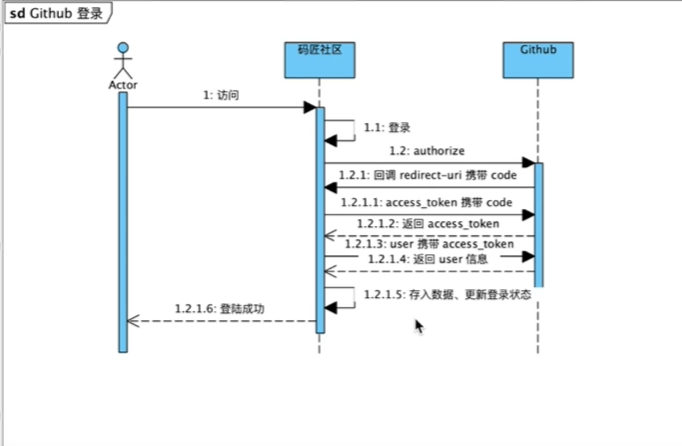

# carat
## 网址
[spring初始化](https://spring.io/guides)

## 资料
[设置git秘钥](https://docs.github.com/en/authentication/connecting-to-github-with-ssh/checking-for-existing-ssh-keys)

[git push错误failed to push some refs to的解决方法](https://www.cnblogs.com/Rainingday/p/12364690.html)

[如何操作本地仓库](https://blog.csdn.net/TroyeSivanlp/article/details/121172010)

